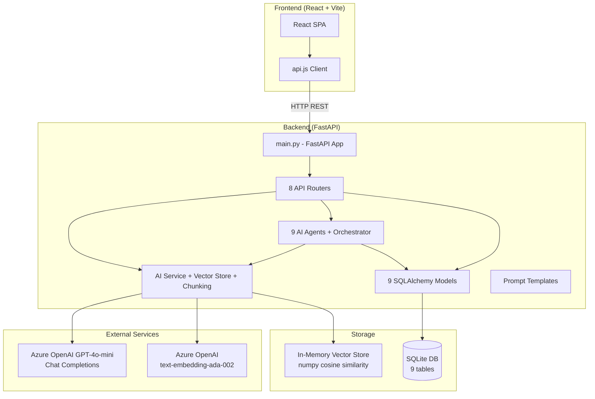
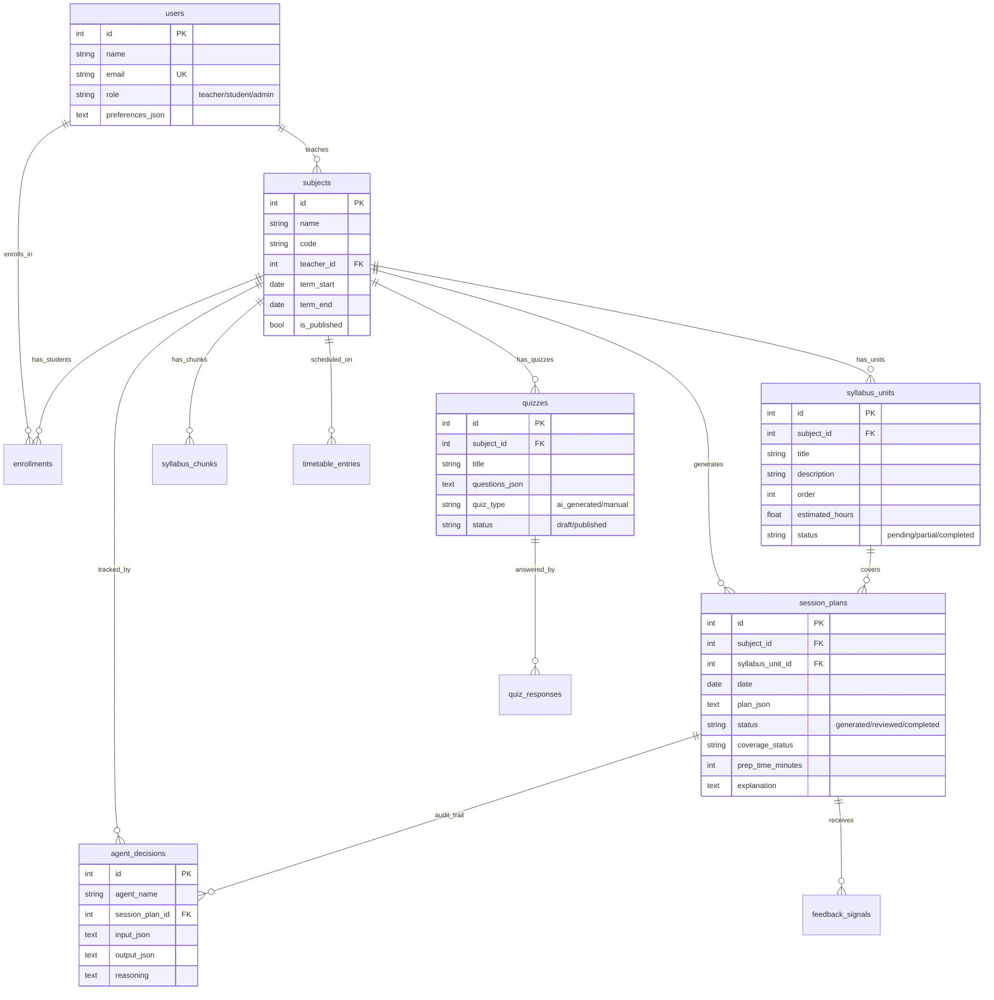
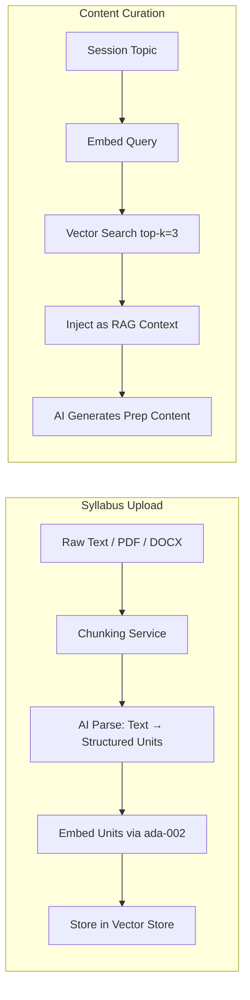
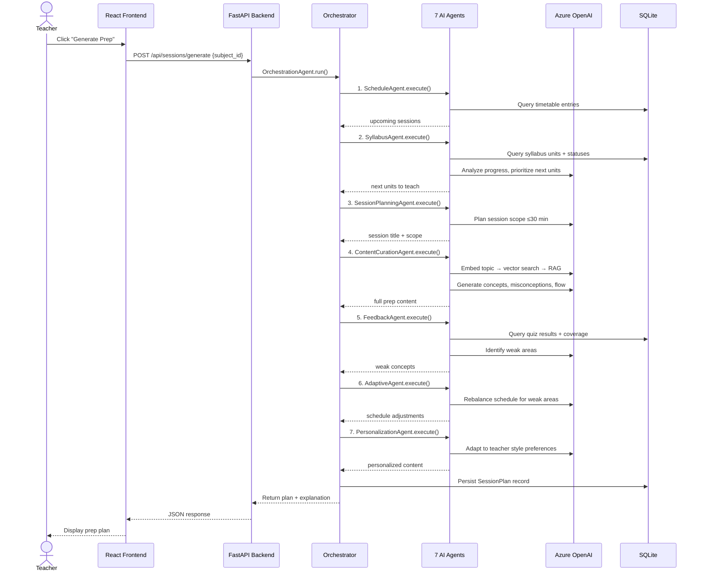

# AI-Driven Teacher Session Preparation Portal — Full Walkthrough

## What Is This App?

This is a **full-stack AI-powered educational platform** that helps teachers prepare for their upcoming classes in a **30-minute window**. It uses a **multi-agent AI pipeline** (9 specialized agents) orchestrated in sequence to automatically generate session preparation plans — including key concepts, misconceptions, teaching flow, examples, and quizzes.

The app serves **two user roles**:
- **Teachers** — manage courses, upload syllabi, view timetables, generate AI session prep, create quizzes, and track analytics
- **Students** — browse/enroll in courses, take quizzes, and view their dashboard

---

## Architecture Overview

---

## Technology Stack

| Layer | Technology | Details |
|-------|-----------|---------|
| **Frontend** | React 18 + Vite 5 | SPA with react-router-dom v6, vanilla CSS |
| **Backend** | FastAPI 0.115 + Uvicorn | Python REST API with auto-docs at `/docs` |
| **ORM** | SQLAlchemy 2.0 | Declarative models with Pydantic v2 schemas |
| **Database** | SQLite | 9 tables, swappable to PostgreSQL |
| **AI Chat** | Azure OpenAI (GPT-4o-mini) | Via `openai` SDK with two API keys |
| **Embeddings** | Azure text-embedding-ada-002 | 1536-dim vectors, secondary API key |
| **Vector Store** | In-memory numpy | Cosine similarity search (prod: swap to FAISS/Pinecone) |
| **Agent Framework** | LangGraph / LangChain | Listed in deps, agents follow custom BaseAgent pattern |
| **Validation** | Pydantic v2 + pydantic-settings | Request/response schemas + env config |
| **File Parsing** | PyPDF2 + python-docx | PDF/DOCX syllabus upload support |

---

## Database Schema (9 Tables)

### Key Models

| Model | File | Purpose |
|-------|------|---------|
| `User` | [user.py](file:///home/support/zee_workspace/zee/Teching_app/backend/models/user.py) | Teachers, students, admins with preferences |
| `Subject` | [subject.py](file:///home/support/zee_workspace/zee/Teching_app/backend/models/subject.py) | Courses — doubles as browsable courses when `is_published=True` |
| `SyllabusUnit` | [syllabus.py](file:///home/support/zee_workspace/zee/Teching_app/backend/models/syllabus.py) | Individual teaching topics with status tracking |
| `SyllabusChunk` | [syllabus_chunk.py](file:///home/support/zee_workspace/zee/Teching_app/backend/models/syllabus_chunk.py) | Token-safe chunks of uploaded syllabus text for RAG |
| `TimetableEntry` | [timetable.py](file:///home/support/zee_workspace/zee/Teching_app/backend/models/timetable.py) | Weekly schedule slots (day, time, room) |
| `SessionPlan` | [session_plan.py](file:///home/support/zee_workspace/zee/Teching_app/backend/models/session_plan.py) | AI-generated prep plans (JSON blob + explainability) |
| `Quiz` / `QuizResponse` | [quiz.py](file:///home/support/zee_workspace/zee/Teching_app/backend/models/quiz.py) | Quizzes and student submissions with auto-grading |
| `AgentDecision` / `FeedbackSignal` | [agent_decision.py](file:///home/support/zee_workspace/zee/Teching_app/backend/models/agent_decision.py) | Full audit trail of every AI agent decision |
| `Enrollment` | [enrollment.py](file:///home/support/zee_workspace/zee/Teching_app/backend/models/enrollment.py) | Student ↔ Course enrollment records |

---

## Multi-Agent AI Pipeline (The Core Feature)

The heart of the app is a **9-agent sequential pipeline** orchestrated by [orchestrator.py](file:///home/support/zee_workspace/zee/Teching_app/backend/agents/orchestrator.py). When a teacher clicks "Generate Session Prep", the full pipeline runs:

```mermaid
graph LR
    A["1. Schedule Agent"] --> B["2. Syllabus Agent"]
    B --> C["3. Session Planning Agent"]
    C --> D["4. Content Curation Agent"]
    D --> E["5. Feedback Agent"]
    E --> F["6. Adaptive Scheduling Agent"]
    F --> G["7. Personalization Agent"]
    G --> H["Persist SessionPlan to DB"]

    style A fill:#4CAF50,color:#fff
    style B fill:#2196F3,color:#fff
    style C fill:#FF9800,color:#fff
    style D fill:#9C27B0,color:#fff
    style E fill:#F44336,color:#fff
    style F fill:#00BCD4,color:#fff
    style G fill:#E91E63,color:#fff
    style H fill:#607D8B,color:#fff
```

### Agent Details

| # | Agent | File | What It Does |
|---|-------|------|-------------|
| 1 | **Schedule Awareness** | [schedule_agent.py](file:///home/support/zee_workspace/zee/Teching_app/backend/agents/schedule_agent.py) | Queries timetable DB, finds sessions in next 7 days. Pure DB logic, no AI call. |
| 2 | **Syllabus Progress** | [syllabus_agent.py](file:///home/support/zee_workspace/zee/Teching_app/backend/agents/syllabus_agent.py) | Counts completed/partial/pending units, uses AI to prioritize what to teach next |
| 3 | **Session Planning** | [session_planning_agent.py](file:///home/support/zee_workspace/zee/Teching_app/backend/agents/session_planning_agent.py) | AI determines session scope, respects 30-min prep cap, considers teacher preferences |
| 4 | **Content Curation** | [content_curation_agent.py](file:///home/support/zee_workspace/zee/Teching_app/backend/agents/content_curation_agent.py) | **RAG-powered**: embeds query → vector search → AI generates concepts, misconceptions, flow, examples |
| 5 | **Feedback Analysis** | [feedback_agent.py](file:///home/support/zee_workspace/zee/Teching_app/backend/agents/feedback_agent.py) | Analyzes quiz results + coverage history to identify weak areas |
| 6 | **Adaptive Scheduling** | [adaptive_scheduling_agent.py](file:///home/support/zee_workspace/zee/Teching_app/backend/agents/adaptive_scheduling_agent.py) | AI rebalances future schedule based on weak areas, without extending term dates |
| 7 | **Personalization** | [personalization_agent.py](file:///home/support/zee_workspace/zee/Teching_app/backend/agents/personalization_agent.py) | Adjusts content style to match teacher preferences (detailed vs concise, real-world vs theoretical) |

### Agent Base Class

All agents inherit from [BaseAgent](file:///home/support/zee_workspace/zee/Teching_app/backend/agents/base.py) which provides:
- Access to `self.ai` (AIService singleton) for OpenAI calls
- Access to `self.db` (SQLAlchemy session) for database queries
- `log_decision()` — persists every agent's input/output/reasoning to `agent_decisions` table for **full explainability**
- Standard `AgentResult` dataclass: `{success, data, reasoning, error}`

### Orchestrator Flow

The [OrchestrationAgent](file:///home/support/zee_workspace/zee/Teching_app/backend/agents/orchestrator.py) manages the pipeline state using a `TypedDict` (`OrchestratorState`). Each agent's output feeds into the next. The final result is:
1. Persisted as a `SessionPlan` record with JSON content
2. Annotated with a human-readable explanation
3. Returned to the frontend for display

---

## RAG Pipeline (Retrieval-Augmented Generation)

The app implements a full RAG workflow for syllabus content:

### Key Services

| Service | File | Responsibility |
|---------|------|---------------|
| **AIService** | [ai_service.py](file:///home/support/zee_workspace/zee/Teching_app/backend/services/ai_service.py) | Dual Azure OpenAI clients (Key 1: chat, Key 2: embeddings). `chat()`, `chat_json()`, `embed()` methods |
| **ChunkingService** | [chunking_service.py](file:///home/support/zee_workspace/zee/Teching_app/backend/services/chunking_service.py) | Splits text into token-safe chunks (2000 tok max, 200 tok overlap). Supports PDF/DOCX extraction. Processes each chunk via AI then de-duplicates |
| **VectorStore** | [vector_store.py](file:///home/support/zee_workspace/zee/Teching_app/backend/services/vector_store.py) | In-memory numpy cosine similarity. Implements `Protocol` for easy swap to FAISS/Pinecone |

---

## API Surface (8 Routers, ~25 endpoints)

| Router | File | Key Endpoints |
|--------|------|--------------|
| **Auth** | [auth.py](file:///home/support/zee_workspace/zee/Teching_app/backend/routers/auth.py) | `POST /api/auth/login` (mock auth, any password) |
| **Subjects** | [subjects.py](file:///home/support/zee_workspace/zee/Teching_app/backend/routers/subjects.py) | CRUD for subjects/courses |
| **Syllabus** | [syllabus.py](file:///home/support/zee_workspace/zee/Teching_app/backend/routers/syllabus.py) | Upload (text/file), get hierarchy, update unit status, topic insights |
| **Timetable** | [timetable.py](file:///home/support/zee_workspace/zee/Teching_app/backend/routers/timetable.py) | CRUD for weekly schedule entries |
| **Sessions** | [sessions.py](file:///home/support/zee_workspace/zee/Teching_app/backend/routers/sessions.py) | `POST /api/sessions/generate` (triggers full agent pipeline!), list/get plans, update coverage |
| **Quizzes** | [quizzes.py](file:///home/support/zee_workspace/zee/Teching_app/backend/routers/quizzes.py) | AI quiz generation, manual creation, submission with auto-grading, student/teacher views |
| **Analytics** | [analytics.py](file:///home/support/zee_workspace/zee/Teching_app/backend/routers/analytics.py) | Progress summary, schedule adjustments, agent decision audit trail |
| **Courses** | [courses.py](file:///home/support/zee_workspace/zee/Teching_app/backend/routers/courses.py) | Student course browsing, enrollment, and enrolled student listing |

> [!IMPORTANT]
> The **critical endpoint** is `POST /api/sessions/generate` — this triggers the entire 7-agent orchestration pipeline and returns the generated session plan.

---

## Frontend (React SPA)

### Pages (10 components)

| Page | File | Role | Description |
|------|------|------|-------------|
| **Login** | [Login.jsx](file:///home/support/zee_workspace/zee/Teching_app/frontend/src/pages/Login.jsx) | Both | Mock login with email (any password works) |
| **Dashboard** | [Dashboard.jsx](file:///home/support/zee_workspace/zee/Teching_app/frontend/src/pages/Dashboard.jsx) | Teacher | Subject selector + daily session overview |
| **StudentDashboard** | [StudentDashboard.jsx](file:///home/support/zee_workspace/zee/Teching_app/frontend/src/pages/StudentDashboard.jsx) | Student | Enrolled courses + pending quizzes |
| **SyllabusUpload** | [SyllabusUpload.jsx](file:///home/support/zee_workspace/zee/Teching_app/frontend/src/pages/SyllabusUpload.jsx) | Teacher | Text paste or PDF/DOCX upload → AI parsing into units |
| **Timetable** | [Timetable.jsx](file:///home/support/zee_workspace/zee/Teching_app/frontend/src/pages/Timetable.jsx) | Teacher | Weekly schedule grid management |
| **SessionPrep** | [SessionPrep.jsx](file:///home/support/zee_workspace/zee/Teching_app/frontend/src/pages/SessionPrep.jsx) | Teacher | **Star feature**: trigger AI prep generation + view plans |
| **QuizManager** | [QuizManager.jsx](file:///home/support/zee_workspace/zee/Teching_app/frontend/src/pages/QuizManager.jsx) | Teacher | Create/AI-generate quizzes, publish, view responses |
| **StudentQuiz** | [StudentQuiz.jsx](file:///home/support/zee_workspace/zee/Teching_app/frontend/src/pages/StudentQuiz.jsx) | Student | Take quizzes with auto-grading |
| **Analytics** | [Analytics.jsx](file:///home/support/zee_workspace/zee/Teching_app/frontend/src/pages/Analytics.jsx) | Teacher | Progress tracking, weak topics, agent audit trail |
| **CourseBrowser** | [CourseBrowser.jsx](file:///home/support/zee_workspace/zee/Teching_app/frontend/src/pages/CourseBrowser.jsx) | Student | Browse published courses + enroll |

### Routing

The [App.jsx](file:///home/support/zee_workspace/zee/Teching_app/frontend/src/App.jsx) uses role-based routing:
- **Teachers** see: Dashboard, Syllabus, Timetable, Session Prep, Quizzes, Analytics
- **Students** see: Student Dashboard, Course Browser, Quiz Taking

### Navigation

[Sidebar.jsx](file:///home/support/zee_workspace/zee/Teching_app/frontend/src/components/Sidebar.jsx) provides the sidebar navigation with role-aware links.

---

## Data Flow: Session Preparation (End-to-End)

---

## Explainability & Audit Trail

Every AI agent decision is logged to the `agent_decisions` table with:
- **Agent name** — which agent made the decision
- **Input JSON** — what context was provided
- **Output JSON** — what the agent produced
- **Reasoning** — human-readable explanation

Teachers can view the full audit trail in the **Analytics** page to understand *why* certain content was recommended.

---

## Demo Data

The [seed_data.py](file:///home/support/zee_workspace/zee/Teching_app/backend/seed_data.py) script creates:
- **6 users**: 2 teachers (Sarah, Mike), 1 admin, 3 students (Alice, Bob, Carol)
- **2 courses**: CS101 (10 units) and MATH201 (8 units) — both published
- **18 syllabus units** with mixed statuses (completed/partial/pending)
- **6 timetable entries** dynamically aligned to today's weekday
- **5 enrollments** (all students in CS101, Alice+Bob in MATH201)

Login: any email from seed data with any password (mock auth).

---

## Key Design Decisions

| Decision | Rationale |
|----------|-----------|
| **30-minute prep cap** | Configurable via `MAX_PREP_TIME_MINUTES` in settings. Enforced by SessionPlanningAgent |
| **Dual API keys** | Key 1 for chat completions, Key 2 for embeddings — enables parallel Azure OpenAI usage |
| **In-memory vector store** | Quick dev setup. Implements a `Protocol` for drop-in replacement with FAISS/Pinecone |
| **Subject = Course** | Same model with `is_published` flag — teachers see subjects, students see published courses |
| **JSON blob storage** | Session plans, quiz questions, and preferences stored as JSON text columns for flexibility |
| **Mock authentication** | No real auth — any password accepted. Designed for demo/POC, not production |
| **Agent decision logging** | Full input/output/reasoning logged for every agent — enables AI explainability |
