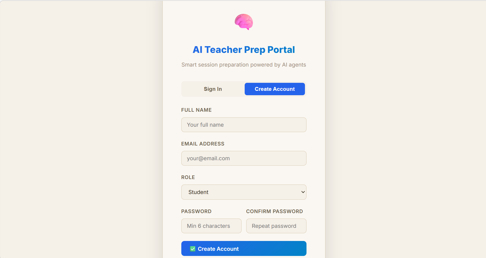
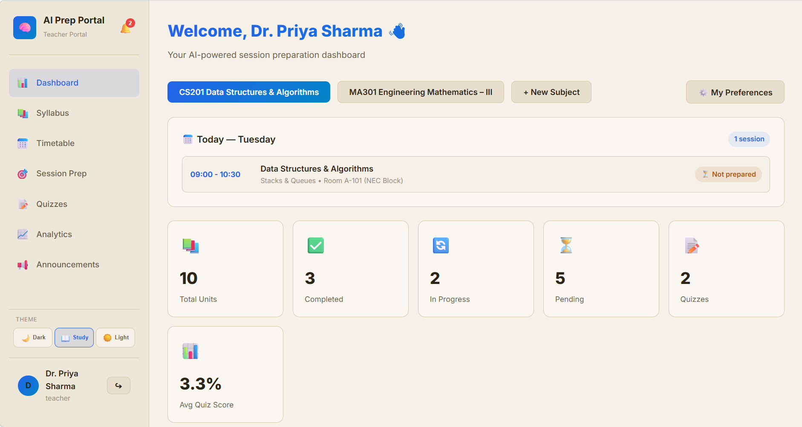
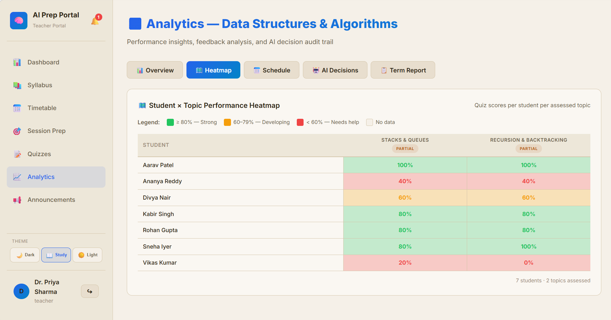
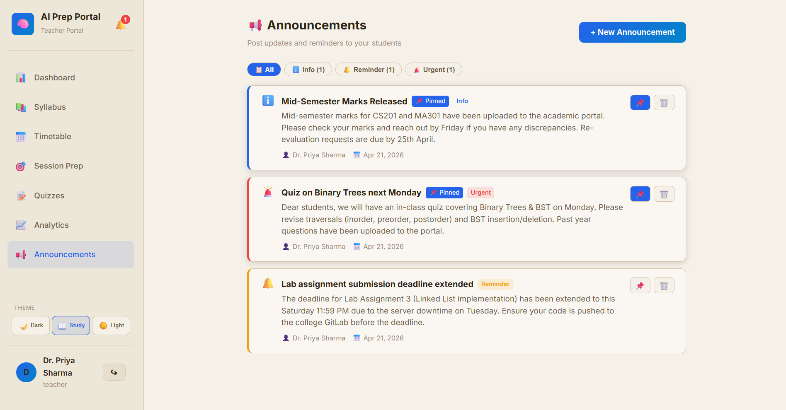
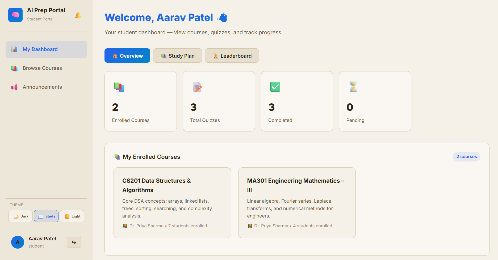
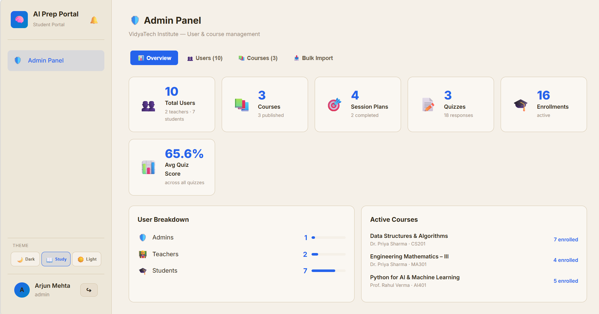
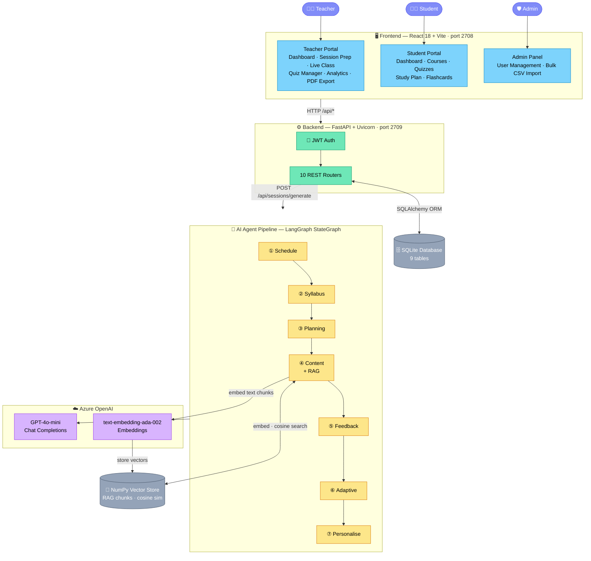

# VidyaAI — AI-Driven Teaching & Learning Portal

> An intelligent, full-stack education platform that helps teachers prepare sessions using a **7-agent AI pipeline**, and gives students a personalised learning experience — adaptive quizzes, announcements, and AI-generated study plans.

---

## Table of Contents
- [Features at a Glance](#features-at-a-glance)
- [Multi-Agent AI Pipeline](#multi-agent-ai-pipeline)
- [Architecture](#architecture)
- [Quick Start](#quick-start)
- [Demo Accounts](#demo-accounts)
- [Environment Variables](#environment-variables)
- [Project Structure](#project-structure)
- [API Reference](#api-reference)
- [Tech Stack](#tech-stack)

---

## Features at a Glance

### 🔐 Secure Login
Role-based JWT authentication. Teachers, students, and admins each land on their own tailored portal after login.



---

### 👩‍🏫 Teacher Experience

#### Dashboard
The teacher home gives a live overview of all subjects — syllabus progress, upcoming sessions, recent quiz scores, and quick-action buttons to jump into session prep or generate a quiz.



#### AI-Generated Session Plan
One click triggers the full 7-agent LangGraph pipeline. Within seconds the teacher receives a structured 30-minute prep plan — key concepts, common misconceptions, a step-by-step teaching flow, worked examples, and a RAG-curated reading list.


#### Live Class Mode
A distraction-free fullscreen view for the classroom. Teachers can flip through concepts one by one, launch a quiz for students in real time, and track how much of the session has been covered.


#### Analytics & Coverage Heatmap
Visual heatmap of topic coverage across the term, overlaid with quiz performance trends and weak-area signals. The agent audit trail shows exactly what each AI agent reasoned and decided.



#### Announcements Board
Teachers post announcements with **Info / Reminder / Urgent** priority levels, pin the important ones, and target a specific subject or the whole class. Posts appear instantly in the student feed.



---

### 👨‍🎓 Student Experience

#### Student Dashboard
Students see their enrolled courses, the next upcoming session for each, their recent quiz scores at a glance, and pending announcements from their teachers.



#### Personalised Study Plan
After each quiz the AI adapts the student's study plan — highlighting weak topics, suggesting focused revision, and reordering upcoming content based on confidence ratings.


#### Quiz with Instant Results & Flashcards
AI-generated MCQ quizzes with per-question difficulty badges. On submission the student gets an instant score, a full answer key with explanations, and auto-generated flashcards for every question they got wrong — great for quick revision.


---

### 🛡️ Admin Experience

#### Admin Panel
A four-tab control centre — platform stats at a glance, full user management (create / edit / delete with role assignment), a course roster with enrollment counts, and a bulk CSV import tool to onboard an entire cohort in one upload.



---

## Multi-Agent AI Pipeline

Triggered by `POST /api/sessions/generate`. Uses **LangGraph StateGraph** to run 7 agents in sequence:

| # | Agent | What it does |
|---|-------|-------------|
| ① | **Schedule Agent** | Reads the timetable and finds the next upcoming session |
| ② | **Syllabus Agent** | AI prioritises the next pending / partial topics |
| ③ | **Planning Agent** | Scopes the prep plan to ≤ 30 minutes |
| ④ | **Content Agent** | RAG — embeds the topic, cosine-searches the top-3 syllabus chunks, generates concepts + examples |
| ⑤ | **Feedback Agent** | Identifies weak areas from previous quiz results |
| ⑥ | **Adaptive Agent** | Rebalances future sessions without moving the term end date |
| ⑦ | **Personalise Agent** | Adapts tone and output style to the teacher's saved preferences |

Every agent logs its `input_json`, `output_json`, and `reasoning` to the `agent_decisions` table for full explainability.

---

## Architecture

### System Overview



### AI Agent Pipeline — Step by Step

```mermaid
flowchart LR
    classDef step fill:#fef3c7,stroke:#d97706,color:#000
    classDef rag  fill:#dbeafe,stroke:#3b82f6,color:#000
    classDef out  fill:#dcfce7,stroke:#16a34a,color:#000

    S1["① Schedule\nAgent\n─────────────\nFinds next\ntimetable slot"]:::step
    S2["② Syllabus\nAgent\n─────────────\nPrioritises\npending topics"]:::step
    S3["③ Planning\nAgent\n─────────────\nScopes plan\nto ≤ 30 min"]:::step
    S4["④ Content\nAgent\n─────────────\nRAG · top-3 chunks\n→ concepts + examples"]:::rag
    S5["⑤ Feedback\nAgent\n─────────────\nSpots weak areas\nfrom quiz data"]:::step
    S6["⑥ Adaptive\nAgent\n─────────────\nRebalances future\nsessions"]:::step
    S7["⑦ Personalise\nAgent\n─────────────\nAdapts tone\nto teacher prefs"]:::step
    OUT["📋 Session Plan\n─────────────\nConcepts · Flow\nMisconceptions\nExamples · Quiz"]:::out

    S1 --> S2 --> S3 --> S4 --> S5 --> S6 --> S7 --> OUT
```



---

## Quick Start

### Prerequisites
- Python 3.10+
- Node.js 18+
- Azure OpenAI credentials (add to `backend/.env` — see `.env.example`)

### 1. Backend

```bash
cd backend

# Create and activate virtualenv
python -m venv venv
source venv/bin/activate        # Mac / Linux
# venv\Scripts\activate         # Windows

pip install -r requirements.txt

# Copy env template and fill in your Azure keys
cp ../.env.example .env

# Seed demo data (run once)
python seed_rich.py

# Start API server
python main.py
# → http://localhost:2709
# → http://localhost:2709/docs  (Swagger UI)
```

### 2. Frontend

```bash
cd frontend
npm install
npm run dev
# → http://localhost:2708
```

Both servers must be running. The Vite dev server proxies `/api` to port 2709.

---

## Demo Accounts

All passwords: **`password`**

| Role | Name | Email |
|------|------|-------|
| Teacher | Dr. Priya Sharma | priya.sharma@vidyatech.edu |
| Teacher | Prof. Rahul Verma | rahul.verma@vidyatech.edu |
| Admin | Arjun Mehta | arjun.mehta@vidyatech.edu |
| Student | Aarav Patel | aarav.patel@student.vidyatech.edu |
| Student | Sneha Iyer | sneha.iyer@student.vidyatech.edu |
| Student | Rohan Gupta | rohan.gupta@student.vidyatech.edu |

---

## Environment Variables

Copy `.env.example` to `backend/.env` and fill in your values:

```env
AZURE_API_KEY=<Chat completions key>
AZURE_API_KEY_2=<Embeddings key>
AZURE_API_BASE=https://<your-resource>.openai.azure.com/
AZURE_API_VERSION=2024-10-21
AZURE_DEPLOYMENT_NAME=gpt-4o-mini
AZURE_OPENAI_EMBEDDING_DEPLOYMENT=text-embedding-ada-002
DATABASE_URL=sqlite:///./teaching_app.db
SECRET_KEY=<random-secret-for-jwt>
MAX_PREP_TIME_MINUTES=30
CORS_ORIGINS=http://localhost:2708
```

---

## Project Structure

```
Teching_app/
├── .env.example              # Environment variable template
├── README.md
├── assets/                   # App screenshots and media
├── backend/
│   ├── main.py               # FastAPI app, router registration
│   ├── config.py             # Pydantic Settings from .env
│   ├── database.py           # SQLAlchemy engine + session
│   ├── seed_rich.py          # Demo data with Indian names
│   ├── models/               # 9 ORM models
│   ├── schemas/              # Pydantic v2 request/response schemas
│   ├── routers/              # 10 APIRouter modules
│   ├── agents/               # 9 AI agents + LangGraph orchestrator
│   ├── services/             # AIService, ChunkingService, VectorStore
│   └── prompts/              # Centralised prompt templates
└── frontend/
    ├── vite.config.js        # /api proxy → port 2709
    └── src/
        ├── App.jsx            # Role-based routing (teacher / student / admin)
        ├── api.js             # All API calls (25+ functions)
        ├── components/
        │   └── Sidebar.jsx    # Role-aware navigation + notifications bell
        ├── pages/
        │   ├── Login.jsx
        │   ├── Dashboard.jsx          # Teacher
        │   ├── StudentDashboard.jsx   # Student
        │   ├── AdminPanel.jsx         # Admin
        │   ├── SyllabusUpload.jsx
        │   ├── Timetable.jsx
        │   ├── SessionPrep.jsx
        │   ├── LiveClassMode.jsx
        │   ├── QuizManager.jsx
        │   ├── StudentQuiz.jsx
        │   ├── Analytics.jsx
        │   ├── CourseBrowser.jsx
        │   └── Announcements.jsx
        └── utils/
            └── pdfExport.js           # Browser-based PDF export
```

---

## API Reference

| Method | Endpoint | Description |
|--------|----------|-------------|
| POST | `/api/auth/login` | JWT login |
| GET | `/api/auth/me` | Current user |
| GET/POST | `/api/subjects/` | Subjects (courses) |
| POST | `/api/syllabus/upload` | AI-parse syllabus |
| GET | `/api/syllabus/{id}` | Get units + chunks |
| POST | `/api/timetable/` | Add schedule slot |
| POST | `/api/sessions/generate` | Run 7-agent pipeline |
| GET | `/api/sessions/{subject_id}` | Session plans |
| POST | `/api/quizzes/generate` | AI quiz generation |
| POST | `/api/quizzes/{id}/submit` | Submit answers + auto-grade |
| GET | `/api/analytics/{subject_id}` | Analytics summary |
| POST | `/api/announcements/` | Create announcement |
| GET | `/api/announcements/student/{id}` | Student announcement feed |
| GET/POST | `/api/admin/users` | Admin user management |
| POST | `/api/admin/bulk-import` | CSV bulk user import |

---

## Tech Stack

| Layer | Technology |
|-------|-----------|
| Frontend | React 18, Vite, react-router-dom v6, vanilla CSS |
| Backend | FastAPI, Uvicorn, SQLAlchemy 2.0, SQLite |
| Auth | JWT (`python-jose`), bcrypt |
| AI | Azure OpenAI GPT-4o-mini (chat) + text-embedding-ada-002 (embeddings) |
| Agents | LangGraph StateGraph, LangChain utilities |
| Vector Store | In-memory NumPy cosine similarity (drop-in replaceable with FAISS/Pinecone) |
