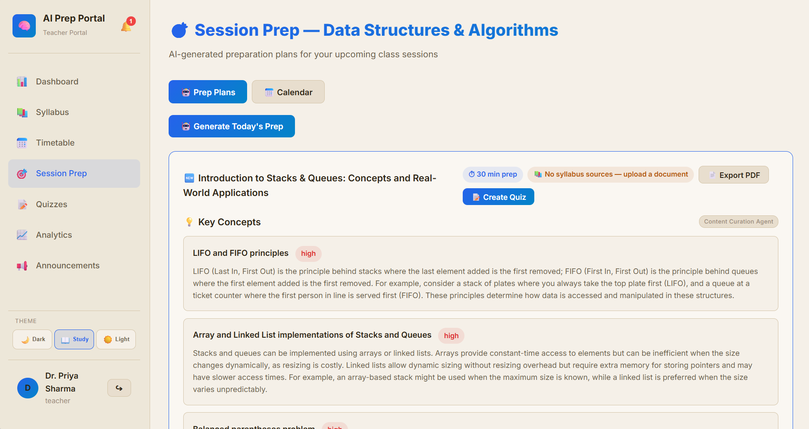
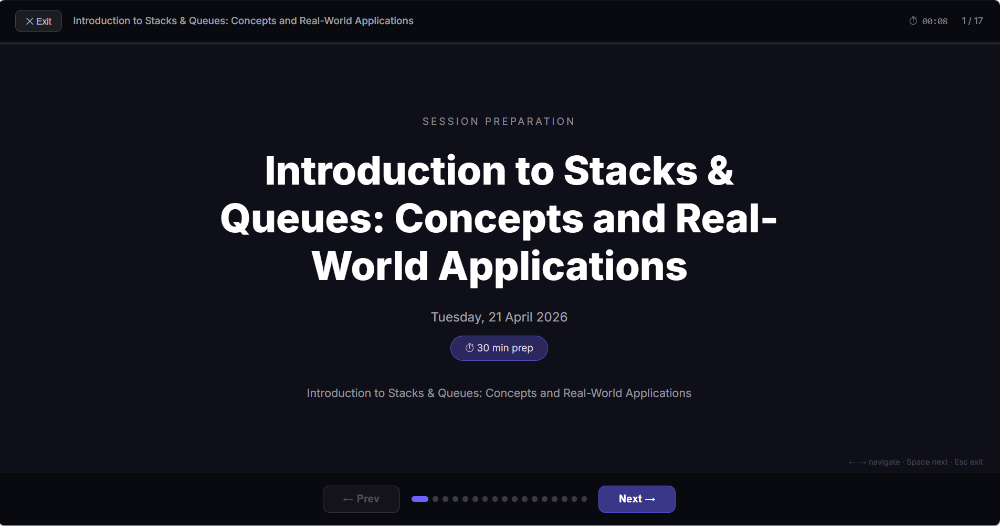
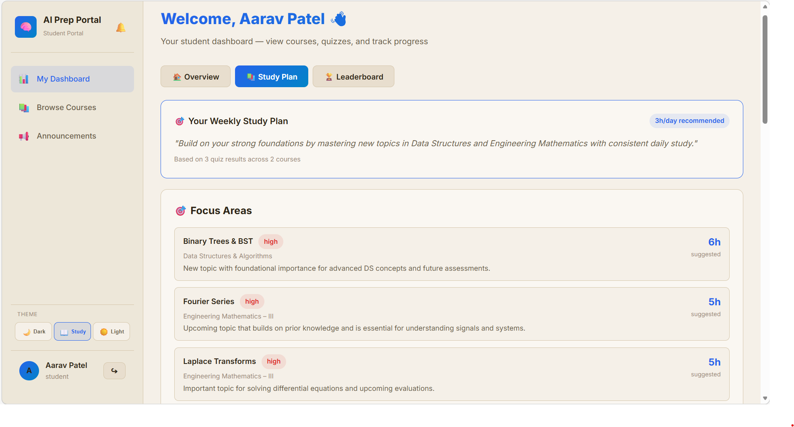
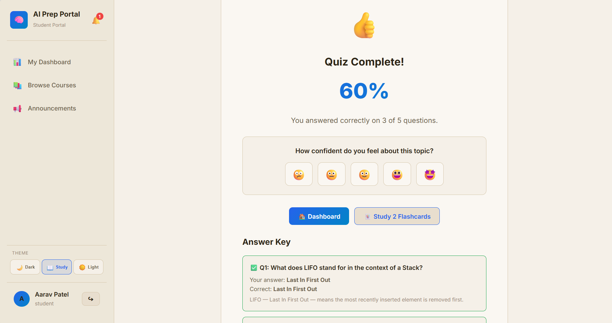

# VidyaAI — AI-Driven Teaching & Learning Portal

> An intelligent, full-stack education platform that helps teachers prepare sessions using a **multi-agent AI pipeline**, and gives students a personalised learning experience — quizzes, announcements, and adaptive study plans.

---

## Screenshots

### Login


### Teacher Dashboard


### AI-Generated Session Plan


### Live Class Mode


### Analytics & Heatmap


### Announcements Board (Teacher)


### Admin Panel


### Student Dashboard


### Personalised Study Plan


### Quiz Result with Flashcards


---

## Features

### For Teachers
| Feature | Description |
|---------|-------------|
| 🧠 AI Session Prep | 7-agent LangGraph pipeline generates a 30-min prep plan — concepts, misconceptions, teaching flow, examples |
| 📚 Syllabus Upload | AI parses raw syllabus text into structured topics with progress tracking |
| 📅 Timetable | Weekly schedule management with drag-free slot management |
| 🎯 Live Class Mode | Fullscreen presentation view — whiteboard, concept flipper, quiz launcher |
| 📝 Quiz Manager | AI-generates quizzes per topic, auto-grades, shows per-student responses and leaderboard |
| 📈 Analytics | Coverage heatmap, weak topic detection, quiz performance trends, agent audit trail |
| 📢 Announcements | Post pinnable announcements with Info / Reminder / Urgent priority levels |
| 📄 PDF Export | Export session plans and term reports as print-ready PDFs from the browser |

### For Students
| Feature | Description |
|---------|-------------|
| 🏠 My Dashboard | Enrolled courses, upcoming sessions, recent quiz scores |
| 📚 Course Browser | Browse and self-enroll in published courses |
| 📝 Quizzes | Attempt AI-generated quizzes; submit and see a scored result instantly |
| 🃏 Flashcards | Wrong answers automatically become review flashcards after submission |
| 😃 Confidence Rating | Self-rate confidence after each quiz — feeds back to the teacher |
| 📢 Announcements | Read teacher announcements sorted by priority and date |

### For Admins
| Feature | Description |
|---------|-------------|
| 🛡️ Admin Panel | Overview stats — total users, courses, quizzes, average score |
| 👥 User Management | Create, edit, delete users; assign roles (teacher / student / admin) |
| 📋 Bulk Import | Upload a CSV to create multiple users at once; template download included |
| 📊 Courses Overview | View all published courses with teacher name and enrollment count |

---

## Multi-Agent AI Pipeline

Triggered by `POST /api/sessions/generate`. Uses **LangGraph StateGraph** to run 7 agents in sequence:

```
1. ScheduleAgent        → Finds the next upcoming timetable session
2. SyllabusAgent        → AI prioritises the next pending/partial topics
3. SessionPlanningAgent → Scopes plan to ≤30 min
4. ContentCurationAgent → RAG: embed topic → cosine search → inject top-3 chunks → generate concepts
5. FeedbackAgent        → Identifies weak areas from previous quiz results
6. AdaptiveSchedulingAgent → Rebalances future sessions around weak areas
7. PersonalizationAgent → Adapts output style to teacher preferences
```

Every agent logs its `input_json`, `output_json`, and `reasoning` to the `agent_decisions` table for full explainability.

---

## Architecture

### System Overview


### AI Agent Pipeline — Step by Step

```mermaid
flowchart LR
    classDef step fill:#fef3c7,stroke:#d97706,color:#000
    classDef rag  fill:#dbeafe,stroke:#3b82f6,color:#000
    classDef out  fill:#dcfce7,stroke:#16a34a,color:#000

    S1["① Schedule\nAgent\n─────────────\nFinds next\ntimetable slot"]:::step
    S2["② Syllabus\nAgent\n─────────────\nPrioritises\npending topics"]:::step
    S3["③ Planning\nAgent\n─────────────\nScopes plan\nto ≤ 30 min"]:::step
    S4["④ Content\nAgent\n─────────────\nRAG · top-3 chunks\n→ concepts + examples"]:::rag
    S5["⑤ Feedback\nAgent\n─────────────\nSpots weak areas\nfrom quiz data"]:::step
    S6["⑥ Adaptive\nAgent\n─────────────\nRebalances future\nsessions"]:::step
    S7["⑦ Personalise\nAgent\n─────────────\nAdapts tone\nto teacher prefs"]:::step
    OUT["📋 Session Plan\n─────────────\nConcepts · Flow\nMisconceptions\nExamples · Quiz"]:::out

    S1 --> S2 --> S3 --> S4 --> S5 --> S6 --> S7 --> OUT
```



---

## Quick Start

### Prerequisites
- Python 3.10+
- Node.js 18+
- Azure OpenAI credentials (add to `backend/.env` — see `.env.example`)

### 1. Backend

```bash
cd backend

# Create and activate virtualenv
python -m venv venv
source venv/bin/activate        # Mac / Linux
# venv\Scripts\activate         # Windows

pip install -r requirements.txt

# Copy env template and fill in your Azure keys
cp ../.env.example backend/.env

# Seed demo data (run once)
python seed_rich.py

# Start API server
python main.py
# → http://localhost:2709
# → http://localhost:2709/docs  (Swagger UI)
```

### 2. Frontend

```bash
cd frontend
npm install
npm run dev
# → http://localhost:2708
```

Both servers must be running. The Vite dev server proxies `/api` to port 2709.

---

## Demo Accounts

All passwords: **`password`**

| Role | Name | Email |
|------|------|-------|
| Teacher | Dr. Priya Sharma | priya.sharma@vidyatech.edu |
| Teacher | Prof. Rahul Verma | rahul.verma@vidyatech.edu |
| Admin | Arjun Mehta | arjun.mehta@vidyatech.edu |
| Student | Aarav Patel | aarav.patel@student.vidyatech.edu |
| Student | Sneha Iyer | sneha.iyer@student.vidyatech.edu |
| Student | Rohan Gupta | rohan.gupta@student.vidyatech.edu |

---

## Environment Variables

Copy `.env.example` to `backend/.env` and fill in your values:

```env
AZURE_API_KEY=<Chat completions key>
AZURE_API_KEY_2=<Embeddings key>
AZURE_API_BASE=https://<your-resource>.openai.azure.com/
AZURE_API_VERSION=2024-10-21
AZURE_DEPLOYMENT_NAME=gpt-4o-mini
AZURE_OPENAI_EMBEDDING_DEPLOYMENT=text-embedding-ada-002
DATABASE_URL=sqlite:///./teaching_app.db
SECRET_KEY=<random-secret-for-jwt>
MAX_PREP_TIME_MINUTES=30
CORS_ORIGINS=http://localhost:2708
```

---

## Project Structure

```
Teching_app/
├── .env.example              # Environment variable template
├── README.md
├── screenshots/              # App screenshots for README
├── backend/
│   ├── main.py               # FastAPI app, router registration
│   ├── config.py             # Pydantic Settings from .env
│   ├── database.py           # SQLAlchemy engine + session
│   ├── seed_rich.py          # Indian-name demo data (CHRO demo)
│   ├── models/               # 9 ORM models
│   ├── schemas/              # Pydantic v2 request/response schemas
│   ├── routers/              # 10 APIRouter modules
│   ├── agents/               # 9 AI agents + LangGraph orchestrator
│   ├── services/             # AIService, ChunkingService, VectorStore
│   └── prompts/              # Centralised prompt templates
└── frontend/
    ├── vite.config.js        # /api proxy → port 2709
    └── src/
        ├── App.jsx            # Role-based routing (teacher / student / admin)
        ├── api.js             # All API calls (25+ functions)
        ├── components/
        │   └── Sidebar.jsx    # Role-aware navigation + notifications bell
        ├── pages/
        │   ├── Login.jsx
        │   ├── Dashboard.jsx          # Teacher
        │   ├── StudentDashboard.jsx   # Student
        │   ├── AdminPanel.jsx         # Admin
        │   ├── SyllabusUpload.jsx
        │   ├── Timetable.jsx
        │   ├── SessionPrep.jsx
        │   ├── LiveClassMode.jsx
        │   ├── QuizManager.jsx
        │   ├── StudentQuiz.jsx
        │   ├── Analytics.jsx
        │   ├── CourseBrowser.jsx
        │   └── Announcements.jsx
        └── utils/
            └── pdfExport.js           # Browser-based PDF export
```

---

## API Reference

| Method | Endpoint | Description |
|--------|----------|-------------|
| POST | `/api/auth/login` | JWT login |
| GET | `/api/auth/me` | Current user |
| GET/POST | `/api/subjects/` | Subjects (courses) |
| POST | `/api/syllabus/upload` | AI-parse syllabus |
| GET | `/api/syllabus/{id}` | Get units + chunks |
| POST | `/api/timetable/` | Add schedule slot |
| POST | `/api/sessions/generate` | Run 7-agent pipeline |
| GET | `/api/sessions/{subject_id}` | Session plans |
| POST | `/api/quizzes/generate` | AI quiz generation |
| POST | `/api/quizzes/{id}/submit` | Submit answers + auto-grade |
| GET | `/api/analytics/{subject_id}` | Analytics summary |
| POST | `/api/announcements/` | Create announcement |
| GET | `/api/announcements/student/{id}` | Student announcement feed |
| GET/POST | `/api/admin/users` | Admin user management |
| POST | `/api/admin/bulk-import` | CSV bulk user import |

---

## Tech Stack

| Layer | Technology |
|-------|-----------|
| Frontend | React 18, Vite, react-router-dom v6, vanilla CSS |
| Backend | FastAPI, Uvicorn, SQLAlchemy 2.0, SQLite |
| Auth | JWT (`python-jose`), bcrypt |
| AI | Azure OpenAI GPT-4o-mini (chat) + text-embedding-ada-002 (embeddings) |
| Agents | LangGraph StateGraph, LangChain utilities |
| Vector Store | In-memory NumPy cosine similarity (drop-in replaceable with FAISS/Pinecone) |
